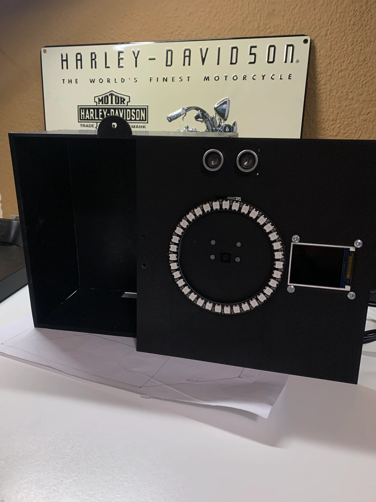
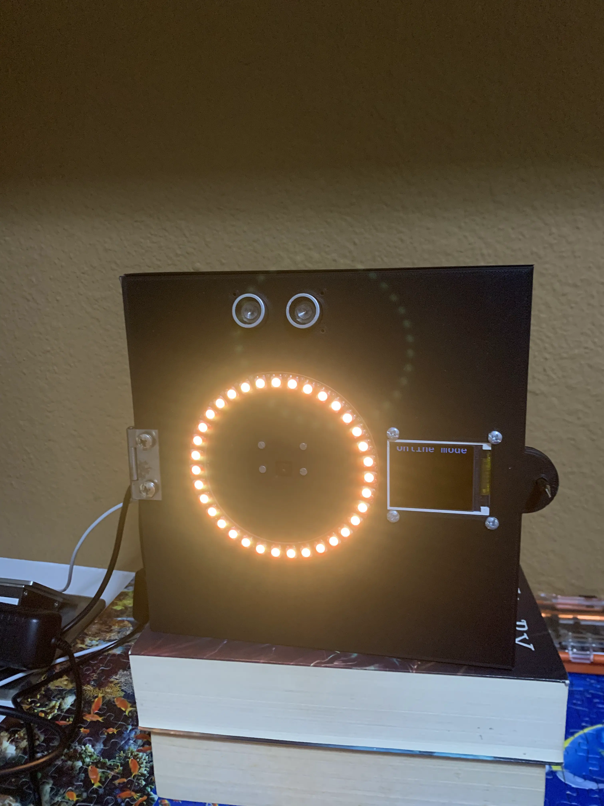
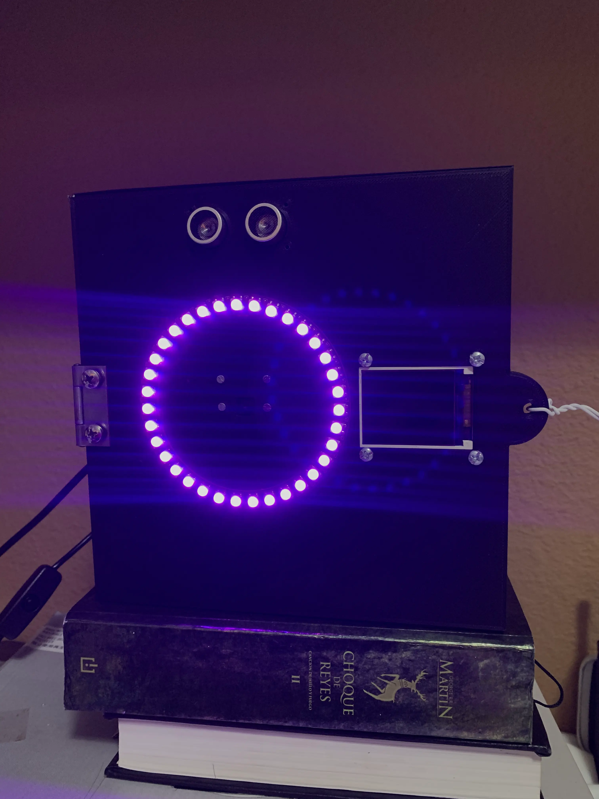

# Optimización de la seguridad mediante visión computacional (Raspbberry PI Code)

<div align = "center">  </div>

## Acerca del proyecto

<p> Sistema de acceso basado en el reconocimiento facial. El Raspberry PI emite una señal de voltaje como respuesta a la identificación facial exitosa para activar algún mecanismo que brinde  acceso a un establecimiento o area. En este caso, esta señal se representa mediante colores en la luz del anillo LED.  </p>

### Construido con

#### Software

![Python]
![OpenCV]
![Ultralytics]
![DeepFace]
![Anaconda]

#### Hardware

![RaspberryPI]
![HCSR04]
![LedRing]
![camara]
![SPI]

## Uso


### Modo de ejecución online

<div align="center"> <div align = "center">  </div>  </div>

* Envío de mensajes vía WhatsApp como notificaciones del sistema, como accesos exitosos o ataques de presentación.
* Intervalos de tiempo en los cuales si se detecta un ataque de presentación, el sistema se bloquea.
* Obtener la información de acceso a una base de datos en la nube.


### Modo de ejecución offline.

<div align="center"> <div align = "center">  </div>  </div>

* Realiza el reconocimiento con base en las imágenes almacenadas en los archivos del sistema.
* Se ejecuta cuando no se puede conectar al servidor que contiene la información de reconocimiento o no hay conexión a internet. 


### Reconocimiento facial.

<div align="center"> <div align = "center">  </div>  </div>

Se coloca el rostro de una persona enfrente del dispositivo y el sensor detecta que hay un objeto, se abre la cámara y se analizan las imágenes para el reconocimiento facial.


### Estructura de archivos
```text
camera/utils
requirements.txt
__main__.py
src/ 
├── main_online.py
├── main_offline.py
├── offline/
│   ├── embedding_processing.py
│   ├── faceclassification.py
│   ├── facepredictions.py
│   └── spoofdetection.py
├── online/
│   └── apirequests.py
├── utils/
│   ├── Hardware/
│   │   ├── camera.py
│   │   ├── display.py
│   │   ├── light.py
│   │   └── sensor.py
│   └── software.py
└── tests/
```

## Contacto

[Instagram](https://www.instagram.com/pablosc_21/) 

[LinkedIn] (https://www.linkedin.com/in/PabloSay21/)


<!-- ACKNOWLEDGMENTS -->
## Reconocimientos

Creditos a:

* [Ultralytics](https://docs.ultralytics.com/)
* [DeepFace](https://github.com/serengil/deepface)


[Python]:https://img.shields.io/badge/Python-gray?logo=python
[OpenCV]:https://img.shields.io/badge/OpenCV-5C3EE8?logo=opencv
[Ultralytics]:https://img.shields.io/badge/Ultralyrics-purple
[DeepFace]: https://img.shields.io/badge/DeepFace-%23f54251
[Anaconda]: https://img.shields.io/badge/Anaconda-gray?logo=Anaconda

[RaspberryPI]: https://img.shields.io/badge/Raspberry_PI-%23A22846?logo=raspberrypi
[HCSR04]: https://img.shields.io/badge/Sensor_HCSR04-blue
[LedRing]:https://img.shields.io/badge/RGB_LED_Ring_WS2812-green
[camara]: https://img.shields.io/badge/OV_5647_Camara-orange
[SPI]: https://img.shields.io/badge/SPI_TFT_Display-ff47dd


